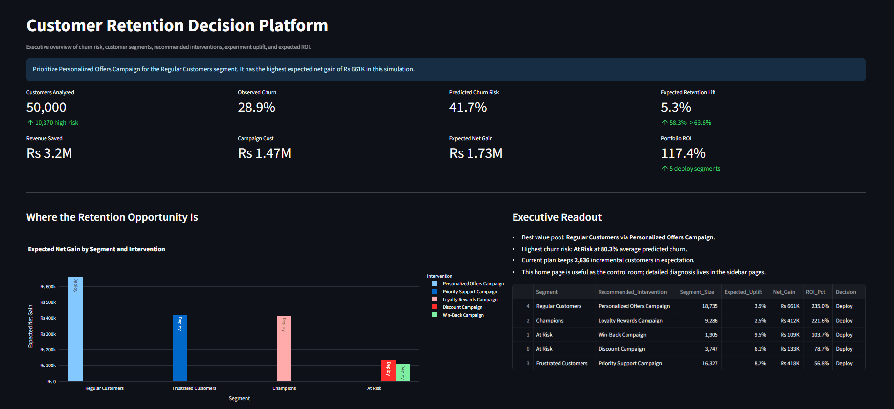
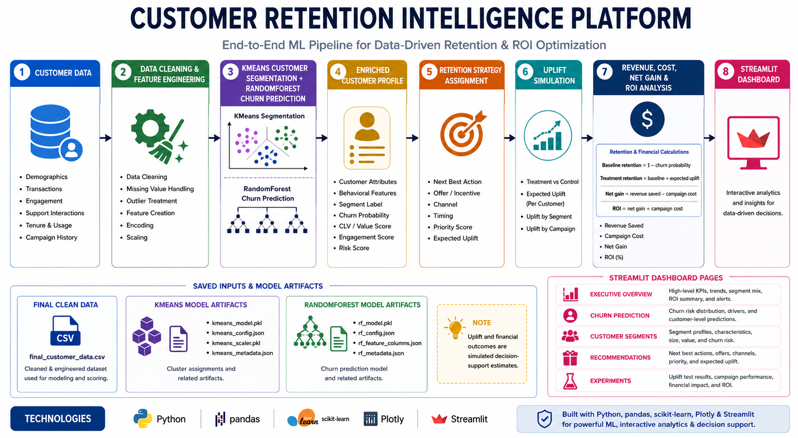
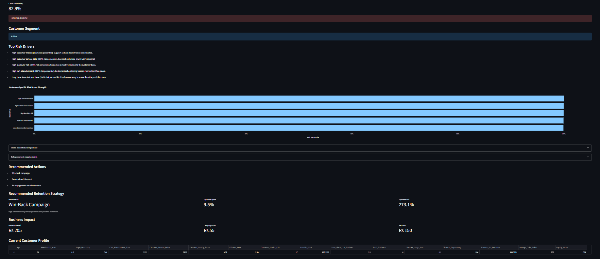
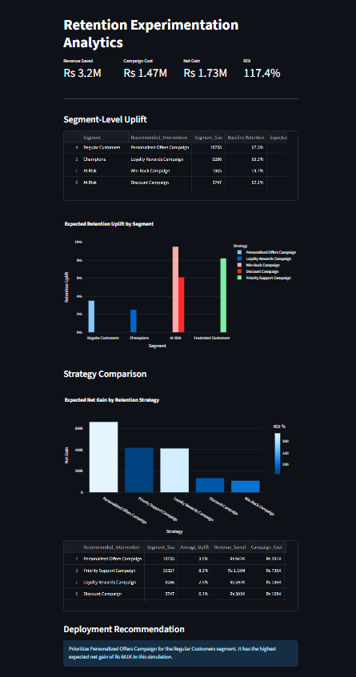
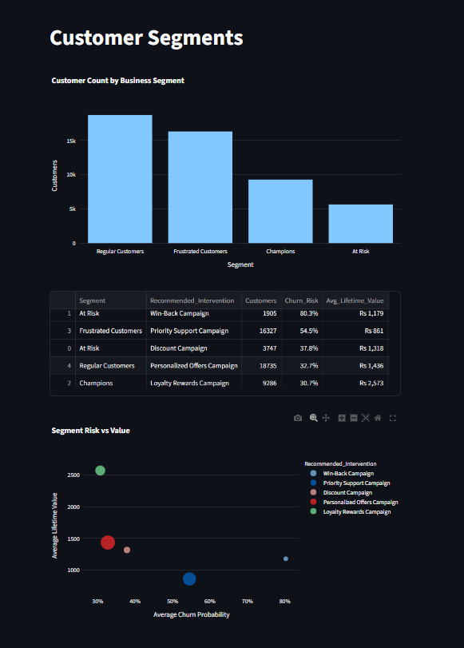

# Customer Retention Intelligence Platform

An end-to-end decision-support platform that identifies customers at risk of churn, explains the underlying risk signals, recommends targeted retention actions, and estimates the business impact of each intervention.

Built with Python, scikit-learn, pandas, Plotly, and Streamlit.

> This project goes beyond predicting churn. It connects model output to customer segments, recommended actions, simulated treatment uplift, campaign cost, expected net gain, and deployment decisions.

## Dashboard Preview

> Executive dashboard  




## Business Problem

A churn probability alone does not tell a retention team what to do next. The platform is designed to answer five operational questions:

1. Which customers are most likely to churn?
2. Why is a customer considered high risk?
3. Which customer segment does the customer belong to?
4. Which retention intervention should be used?
5. Is the expected retention value greater than the campaign cost?


## Project Architecture

The platform separates predictive modeling from the retention decision layer. Saved churn and segmentation models enrich customer data in memory before the strategy, experimentation, and ROI components generate dashboard outputs.

> Project architecture  





## Platform Highlights

- Scores 50,000 customer records using a trained RandomForest churn model.
- Converts KMeans clusters into interpretable business segments.
- Explains predictions through global feature importance and customer-level risk drivers.
- Assigns segment- and risk-specific retention strategies.
- Simulates control and treatment retention outcomes.
- Estimates customers retained, revenue saved, campaign cost, net gain, and ROI.
- Produces segment-level deployment recommendations in an interactive Streamlit application.

## Model Performance

The churn model was evaluated on a held-out test set of 10,000 customers in [`notebooks/03churn_prediction.ipynb`](notebooks/03churn_prediction.ipynb).

| Metric | Score |
| --- | ---: |
| Accuracy | 0.88 |
| Precision, churn class | 0.76 |
| Recall, churn class | 0.85 |
| ROC-AUC | 0.914 |

Recall is particularly important in this use case because a false negative represents a likely churner who receives no retention intervention.

## Model Explainability

The dashboard provides two complementary explanation layers:

- **Global feature importance:** shows which variables have the greatest influence across the RandomForest model.
- **Customer-level risk drivers:** compares an active customer profile with the portfolio and surfaces plain-language signals such as high inactivity, high friction, low loyalty, or high cart abandonment.

> Churn explainability  



## Retention Decision Layer

| Customer Segment | Default Intervention | Decision Rationale |
| --- | --- | --- |
| Champions | Loyalty Rewards Campaign | Protect valuable, engaged customers without excessive discounting |
| At Risk | Discount Campaign | Give inactive customers a clear reason to return |
| High-risk At Risk | Win-Back Campaign | Use a stronger recovery action for severe churn risk |
| Frustrated Customers | Priority Support Campaign | Address service friction directly |
| Regular Customers | Personalized Offers Campaign | Improve engagement through relevant, lower-cost offers |

Each strategy has an assumed treatment uplift and cost per customer. The decision layer uses these assumptions to estimate:

```text
Treatment retention = Baseline retention + Expected uplift
Revenue saved       = Customers retained x Average lifetime value
Net gain            = Revenue saved - Campaign cost
ROI                 = Net gain / Campaign cost
```

> Retention experiments  




## Dashboard Pages

| Page | Purpose |
| --- | --- |
| Executive Overview | Portfolio churn, expected retention lift, model quality, campaign mix, and financial opportunity |
| Churn Prediction | Interactive customer scoring, segment assignment, risk explanation, and recommended action |
| Customer Segments | Segment size, risk, lifetime value, friction, inactivity, and strategy comparison |
| Recommendations | Customer-level intervention details and expected business impact |
| Experiments | Simulated uplift, campaign cost, net gain, ROI, and deployment decisions |

> Customer segments  



## Repository Structure

```text
.
|-- assets/
|   `-- images/                       README screenshots and architecture diagram
|-- dashboard/
|   |-- app.py                        Executive overview
|   |-- retention_engine.py           Strategy, uplift, ROI, and deployment logic
|   |-- utils.py                      Data/model loading and explainability helpers
|   `-- pages/
|       |-- churn.py                  Interactive churn prediction
|       |-- experiments.py            Treatment and ROI simulation
|       |-- recommendations.py        Customer strategy center
|       `-- segments.py               Segment analytics
|-- data/                              Source and processed datasets
|-- models/                            Saved model artifacts
|-- notebooks/
|   |-- 01data_understanding.ipynb
|   |-- 02feature_engineering.ipynb
|   |-- 03churn_prediction.ipynb
|   `-- 04experim_engine.ipynb
|-- RETENTION_PLATFORM_ARCHITECTURE.md
`-- README.md
```

## Run Locally

1. Create and activate a Python environment.
2. Install the required libraries:

```bash
pip install streamlit pandas numpy plotly scikit-learn joblib
```

3. Start the dashboard from the repository root:

```bash
streamlit run dashboard/app.py
```

## Important Assumptions

- Retention uplift values are simulated strategy assumptions, not causal estimates from a completed randomized experiment.
- Revenue saved, net gain, and ROI are directional decision-support estimates rather than audited financial forecasts.
- Feature importance describes the trained RandomForest globally; customer-level risk drivers are interpretable portfolio comparisons rather than SHAP values.
- A production implementation should validate intervention uplift through controlled experiments and monitor model drift over time.

## Potential Next Steps

- Replace assumed uplift with measured treatment effects from randomized experiments.
- Add probability calibration and threshold optimization by campaign capacity.
- Add SHAP explanations for model-specific local attribution.
- Track data drift, model drift, and campaign performance over time.
- Add batch customer export and campaign activation integrations.

## Author
Deepti Bhardwaj
IIT Delhi


